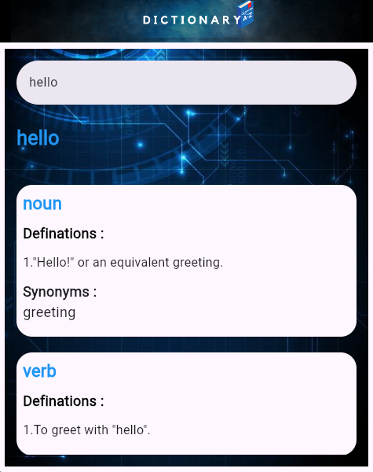

### Flutter Dictionary
With this application, you can effortlessly provide users with detailed word definitions, pronunciation guides, and more, all within your app.

## Features

- **Comprehensive Definitions**: Access detailed and precise definitions for a wide range of words, helping users understand and learn new vocabulary.
- **Usage Examples**: Provides example sentences to illustrate how words are used in context.
- **Synonyms and Antonyms**: Enhance vocabulary with information on synonyms and antonyms.
- **Word Origins**: Explore the etymology of words to understand their historical background.
- **Up-to-Date Content**: Regularly updated to include contemporary terms and evolving language trends.

	

